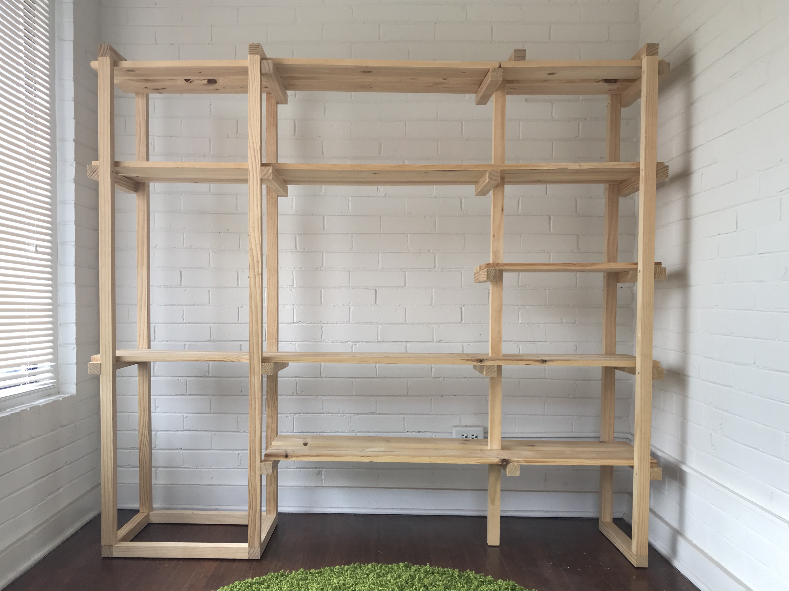
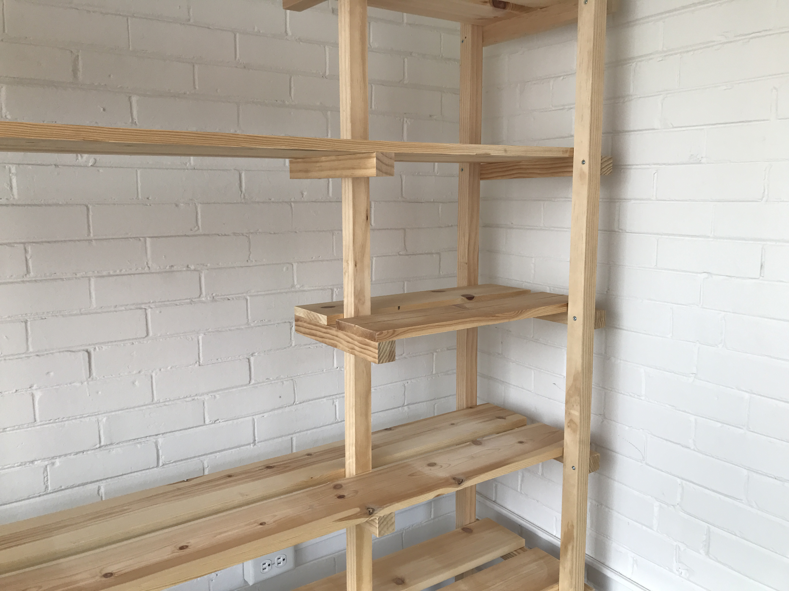
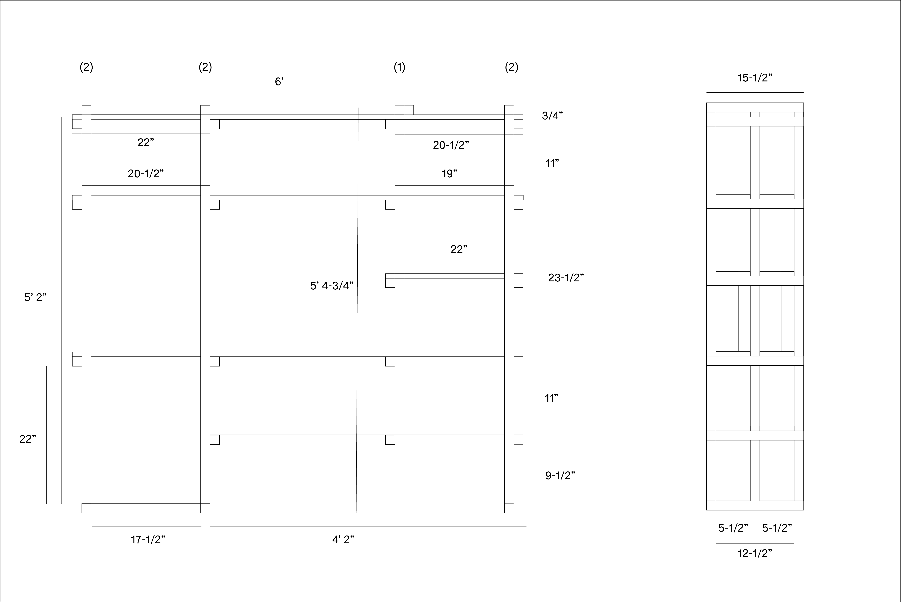
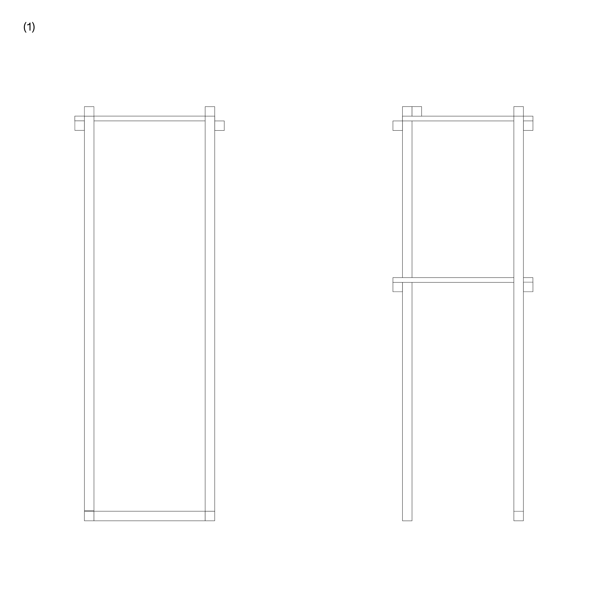
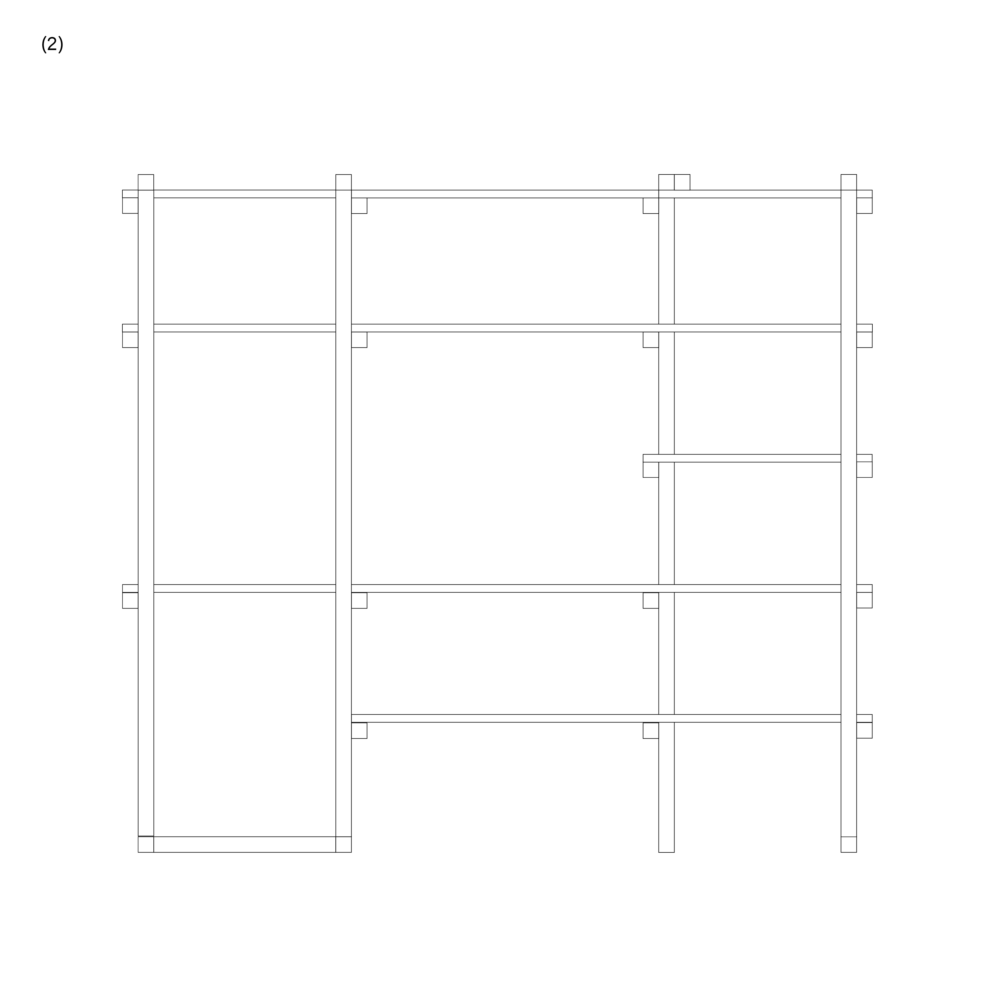

# studio-shelf

# construction

I designed the shelf so that two vertical sections could stand on ther own, which makes solo assembly a little easier.

you can stand these up vertically next to each other then add the longer shelves to connect them together.

note that the top two boards are split into three pieces, then re-attached end-to-end

# materials

materials can be sourced from most lowes stores in the united states

- solid pine.

  | W x H (in) | length (in) |	qty |
  | ---------- | ---------------- | --- |
  | 1-1/2 x 1-1/2 |	96 |	8 |
  | 1-1/2 x 1-1/2	| 72 |	2 
  | 5-1/2 x 3/4 |	72 |	8 |
  
  (actual measurements, not nominal)
  
- wood screws
  - #10 x 2-1/2"
  - #10 x 2"
- sand paper

# tools

while a miter saw & table saw will make the most accurate cuts, I was able to build this piece fairly easily with a small selection of hand tools.

- tape measure
- square
- pencil
- ryoba (japanese hand saw)
- low saw horses (DIY)
- clamps (4)
- level
- power drill (+ impact driver)
- countersink or countersink bit
- sand paper block
- patience

be sure to use the level on every horizontal beam.
